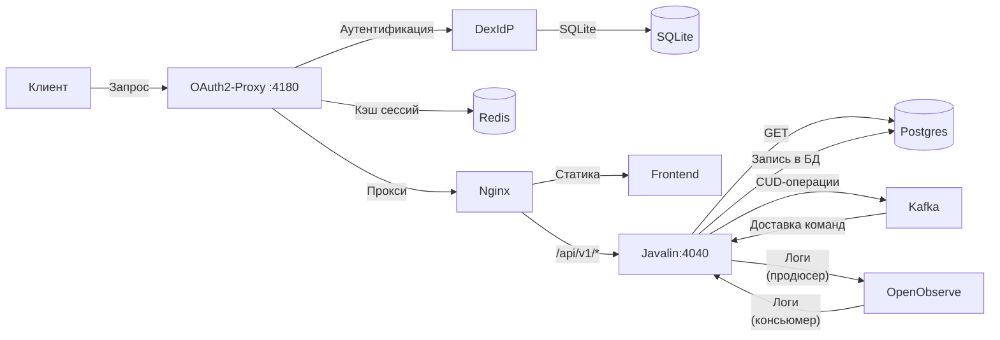

## Архитектура для MVP
LMS представляет два основных сервиса:
- Сервис заметок “Перо”
- Основной сервис LMS

Первая реализация будет предполагать монолитную структуру

## Техническая реализация

1. Front-end: React + TypeScript + Material
2. Back-end: Java + Javalin 
3. Logto - SSO
4. Postgres - РСУБД
5. Nginx - web server/proxy

## Полезные ссылки
- https://github.com/ayozav/lms
- https://www.figma.com/design/t6XW0X1KaQmsppxHwruGsb/LMS?node-id=0-1&t=xXMxyGN4yVOZLkNI-1
